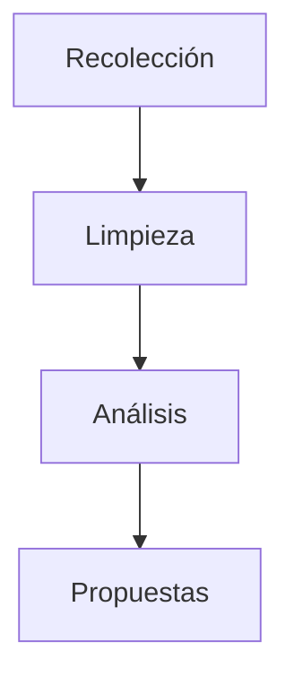
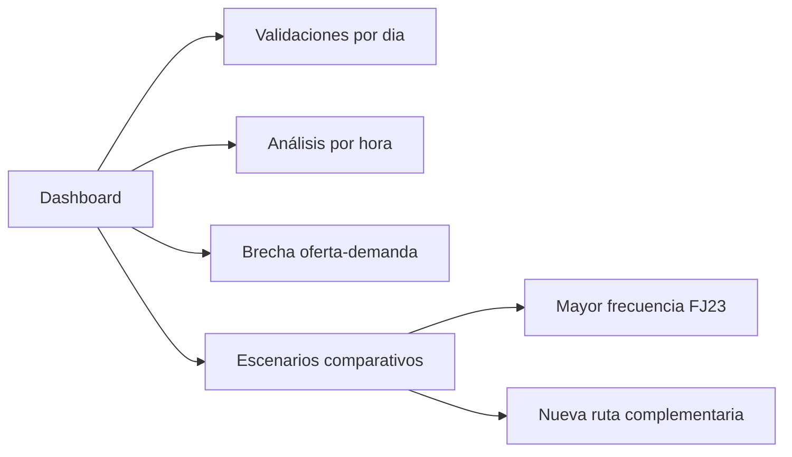

Los datos se obtienen desde **Datos Abiertos Bogotá** y los canales oficiales de **TransMilenio**, siguiendo una metodología de tres etapas:

<

<table>
<tr><th>Etapa</th><th>Acción</th><th>Resultado</th></tr>
<tr><td><b>1. Recolección</b></td><td>Fuentes existentes de Datos Abiertos Bogotá y TransMilenio</td><td>Datos por estación</td></tr>
<tr><td><b>2. Limpieza</b></td><td>Depuración de datos incompletos</td><td>Datos organizados</td></tr>
<tr><td><b>3. Agrupación</b></td><td>Clasificación por horas pico y horas valle</td><td>Patrones de demanda</td></tr>
<tr><td><b>4. Indicador</b></td><td>Validaciones vs frecuencia de la ruta FJ23</td><td>Brecha oferta-demanda</td></tr>
<tr><td><b>5. Diagnóstico</b></td><td>Identificación de franjas críticas</td><td>Momentos de congestión</td></tr>
</table>

> *La capacidad de transporte = frecuencia de buses × capacidad por bus. Si capacidad < validaciones → congestión identificada.*

---

El entregable final es un **tablero de visualización interactivo** que permite:

<table>
<tr><th>Funcionalidad</th><th>Descripción</th></tr>
<tr><td>Validaciones por día</td><td>Patrones de uso semanal por estación</td></tr>
<tr><td>Filtro por hora</td><td>Demanda específica por franja horaria</td></tr>
<tr><td>Oferta vs Demanda</td><td>Comparació SI/NO de cobertura del sistema</td></tr>
<tr><td>Escenarios comparativos</td><td>Simulación de rutas nuevas o mayor frecuencia</td></tr>
</table>

 

> *El producto no solo muestra el problema — evalúa las soluciones.*

---

